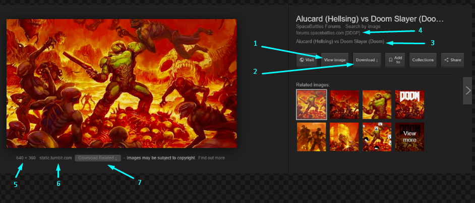

# SuperGoogle for Google Images

- [SuperGoogle for Google Images](#supergoogle-for-google-images)
  - [Description](#description)
  - [Installation](#installation)
    - [UserScript (Tampermonkey)](#userscript-tampermonkey)
    - [Browser extension](#browser-extension)
    - [Display original images](#display-original-images)
    - [Zip and download all the images](#zip-and-download-all-the-images)
    - [Enhance the image panels](#enhance-the-image-panels)
    - [Hotkeys](#hotkeys)
  - [Documentation](#documentation)
  - [External Libraries](#external-libraries)
    - [Libraries](#libraries)
  - [Contributing](#contributing)
  - [License](#license)

## Description

A [browser plugin](https://openuserjs.org/about/Userscript-Beginners-HOWTO) (a browser script/plugin/extension) to add features to Google images, like:  
display full resolution images, zip+download all images, and more. See a list of [all features here](#Features);

See [demo video here](https://youtu.be/ceFuBh8r8GQ?t=24).

## Installation

### UserScript (Tampermonkey)

1. Install [Tampermonkey](install:tampermonkey-chrome) (or any [UserScript client][guide:get-user-script]) for your browser.
2. Click [DOWNLOAD][download-link] (or visit the RAW file url).
3. [Optional: for downloading images] Enable downlaods (see details)

 
Click to expand: How to enable downloads (for Tampermonkey)

  

    <li>Enable `Browser API`. See guide at "<a href="https://www.tampermonkey.net/faq.php#Q302">How do I setup userscript-triggered downloads</a>" 

</li>
<li>When prompted, allow the script to load images, click `always allow all domains` (only needed once). 
  </li>

4. Open any [google image search page](https://www.google.com/search?q=example&tbm=isch&safe=strict) and enjoy the enhanced experience

### Browser extension

Not yet supported, but coming soon!

Below is a list of the available features, listed from what is most useful (IMO).

### Display original images

One of the most important features, replaces thumbnails with the original source images, even GIFs!

### Zip and download all the images

You can even specify the minimum allowed dimensions for images

### Enhance the image panels

Adds the following features to the image panel:

- 1 - Add `view image` button

    Bring back the old `view image` button! Now you won't have to visit the website just to see the fullres image.

- 2 - `download` button

    Directly download the image

- 3 - **Clickable description**

    Lookup the description text, open another Google images page searching for the description text

- 4 - **Proxy** button

    Open page/image using a proxy if it was blocked/failed to load

- 5 - Click to view images with **similar dimensions**

    I really missed this feature when Google removed it

- 6 - Clickable *image host* text

    Click the *image host* to search google for more images from that site. For example if it was hosted by `example.com`, then clicking it would open a google image search of "`site:example.com`"

- 7 - `Download Related` button

    Click to download this image and all the related images (the ones on the bottom right)

- 8 - Clickable *page host* text

    Click the *page host* to search google for more images from that site. For example if it was hosted by `example.com`, then clicking it would open a google image search of "`site:example.com`"

<!-- TODO: continue listing features -->

### Hotkeys

<!-- TODO: list hotkeys -->

## Documentation

- The [docs](docs/doc.md) file contains info about the code and any complicated parts.
- The [reverse engineering](docs\ReverseEngineering.md) contains info about how the website works and the main components it contains (based on observations), such as the CSS selectors for the panels and components, where the info is kept in the page, where thumbnails are loaded and where main images are.

## External Libraries

This script does use several other external libraries and scripts, they will be listed below with links to their sources.

Scripts

- [Google Direct Links for Pages and Images.user.js](lib/Google%20Direct%20Links%20for%20Pages%20and%20Images.user.js), [[source]](https://greasyfork.org/scripts/19210-google-direct-links-for-pages-and-images/code/Google:%20Direct%20Links%20for%20Pages%20and%20Images.user.js)

### Libraries

- [jQuery](https://jquery.com/)
- [Mousetrap.js](https://github.com/ccampbell/mousetrap) keybindings
- [progressbar.js](https://github.com/kimmobrunfeldt/progressbar.js/) progress bar when downloading
- [JSZip](https://github.com/Stuk/jszip) zip and compress functionality

## Contributing

- Fork it!
- Create your feature branch: `git checkout -b my-new-feature`
- Commit your changes: `git commit -am 'Add some feature'`
- Push to the branch: `git push origin my-new-feature`
- Submit a pull request!

## License

[Apache License](LICENSE.md)  
Version 2.0, January 2004

[guide:get-user-script]: https://openuserjs.org/about/Userscript-Beginners-HOWTO#how-do-i-get-going-
[guide:userscript]: https://simply-how.com/enhance-and-fine-tune-any-web-page-the-complete-user-scripts-guide#section-2
[guide:browser-API-beta]: https://www.tampermonkey.net/faq.php#Q302
[guide:browser-API-beta-gif]: https://www.tampermonkey.net/images/animated/gm_download.gif
[download-link]: https://github.com/FarisHijazi/SuperGoogle/raw/master/SuperGoogle.user.js
[install:tampermonkey-chrome]: https://www.tampermonkey.net/index.php?ext=dhdg&browser=chrome
